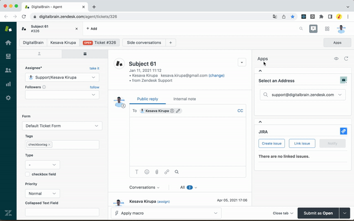

# digitalbrain_test_ext


# Сборка

Команды для сборки:
```
git clone https://github.com/nikitarub/digitalbrain_test_ext.git

cd digitalbrain_ext

npm i
npm run build
```

Появится папка `build/` внутри проекта `digitalbrain_ext/`. Её загружаем в Chrome extension.

Плагин запускается по нажатию на иконку расширения:




# Разработка

## Компоненты
Для разработки компонент используется [Storybook](https://storybook.js.org/).

Запусить:
```

cd digitalbrain_ext

# npm i # если не сделано было раньше
npm run storybook
```

Архитектура компонент: **[Atomic](https://bradfrost.com/blog/post/atomic-web-design/)**-подобная

Компонента главной страницы с кнопками:
* Pages/Main

